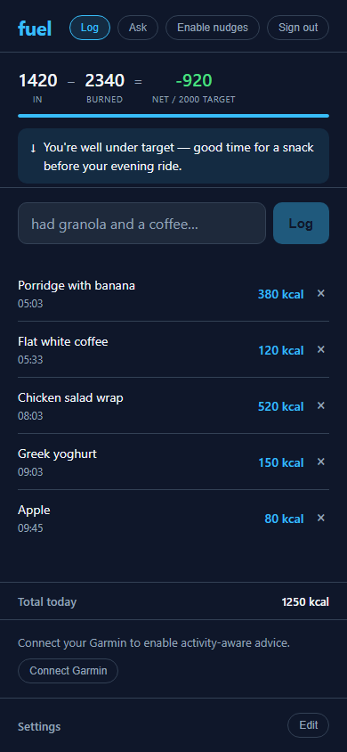

# Fuel

A calorie and activity tracker for cyclists, powered by Claude and Garmin Connect.

Log food in plain English, get a calorie balance against your activity, and ask questions about your fitness data — all from a mobile-friendly web app.



## Features

- **Food logging** — describe what you ate in plain English; Claude estimates calories and macros (protein, carbs, fat)
- **Activity balance** — live calorie in vs. burned, updated from Garmin
- **Conversational health advisor** — ask "how were my steps today?", "how did I sleep last night?", or "how much protein have I had today?" and get answers using your real data
- **Push nudges** — scheduled notifications with time-aware advice (morning vs. evening)
- **Multi-user** — each user has their own data, secured with Firebase Auth

## Using the app

The hosted app is at **https://fuel.wlfdn.dev**

1. Sign in with Google or create an email/password account
2. Log food in the text box ("had porridge and a coffee")
3. Connect Garmin to enable activity data and the Ask tab (see below)
4. Tap **Ask** to chat with Claude about your health and nutrition data

## Connecting Garmin

Garmin uses session tokens that must be generated on your own machine (there is no public OAuth API). Setup takes about two minutes:

### 1. Install the CLI

```bash
pip install garmin-mcp-gt
```

### 2. Authenticate with Garmin

```bash
garmin-setup
```

Enter your Garmin Connect email and password when prompted. Tokens are saved to `~/.garmin_tokens/`.

### 3. Generate an upload token in the app

In the Fuel app, scroll to the bottom of the **Log** tab and tap **Connect Garmin**. This generates a 15-minute upload token.

### 4. Upload your tokens

**On any platform:**
```bash
garmin-upload-tokens --token "paste-token-here"
```

**On Windows (PowerShell), using the repo script:**
```powershell
.\garmin-upload-tokens.ps1 -UploadToken "paste-token-here"
```

That's it. Your Garmin data is now available in the app and the Ask tab will use it.

**Tokens expire** periodically (weeks to months). Re-run `garmin-setup` then `garmin-upload-tokens` when needed.

## Using as an MCP server (Claude Code / Claude Desktop)

`garmin-mcp-gt` is a standalone MCP server — no app account needed. After installing and authenticating, Claude can query your Garmin data directly in any conversation.

### Setup

```bash
pip install garmin-mcp-gt
garmin-setup        # authenticate with your Garmin Connect account once
```

Then add to `~/.claude/settings.json` (Claude Code) or your Claude Desktop config:

```json
{
  "mcpServers": {
    "garmin": {
      "command": "garmin-mcp"
    }
  }
}
```

### Available tools

| Tool | Description |
|------|-------------|
| `get_today_stats` | Steps, distance, calories, active minutes, resting HR, body battery |
| `get_recent_activities` | Last N cycling/running activities with distance, duration, HR, power |
| `get_activity_detail` | Detailed metrics for one activity: HR/power zones, cadence, left/right power balance, power phase angles, platform centre offset |
| `get_activity_fit` | Downloads the raw FIT file and returns TSS, Intensity Factor, total work (kJ), device FTP, and a per-lap breakdown |
| `get_bike_fit_analysis` | Aggregate fit metrics across recent rides and surface actionable signals (cadence, L/R imbalance, power phase, platform offset). Pass `since=YYYY-MM-DD` to compare before/after a bike adjustment |
| `get_ride_fatigue_analysis` | Analyse per-lap FIT data to detect position breakdown under fatigue (PCO drift, cadence drop, power fade) |
| `compare_dual_recordings` | Compare HR and power between two recordings of the same ride on different devices (e.g. chest-strap vs. optical HR) |
| `get_sedentary_analysis` | How sedentary a day was — sedentary/light/moderate/active time breakdown |
| `get_sleep` | Sleep score, stages (deep/REM/light), SpO2, stress |
| `get_hrv` | Overnight HRV history — key recovery metric |
| `get_weekly_trends` | Weekly cycling summary: km, hours, average power |
| `get_cycling_ftp` | Current FTP and W/kg |
| `get_vo2max` | VO2max and lactate threshold history |
| `get_weight` | Weigh-in history: weight, body fat %, muscle mass |
| `get_weight_trend` | Weekly rolling weight averages to track fat loss without hydration noise |
| `get_weather` | Current conditions and cycling forecast via OpenMeteo (free, no API key) — includes rideable flag per day |
| `get_activity_weather` | Weather recorded by Garmin during a specific past activity |
| `get_courses` | Saved courses from Garmin Connect with distance and elevation |

### Example questions

- "How did I sleep last night?"
- "Am I sedentary today?"
- "Analyse my bike fit from my last 5 rides"
- "Compare my bike fit before and after the saddle change I made on 2025-03-01"
- "Did my position break down in the last hour of yesterday's ride?"
- "How does my HRV trend compare to my training load this week?"
- "What's my W/kg and how has my weight changed this month?"

## Architecture

- **Frontend** — React PWA, hosted on Firebase Hosting
- **Backend** — FastAPI on Cloud Run (europe-west1)
- **Database** — SQLite with Litestream replication to GCS (zero managed DB cost)
- **Garmin tokens** — encrypted at rest with Cloud KMS, per-user in SQLite
- **Auth** — Firebase Auth (Google Sign-In + email/password)
- **AI** — Claude API (Haiku for food parsing and recommendations; Sonnet for the Ask tab)

## Self-hosting

The backend is a standard Cloud Run service. To deploy your own instance:

1. Fork this repo
2. Create a GCP project and enable the required APIs
3. Run `backend/setup-wif.ps1` to configure GitHub Actions auth
4. Run `backend/setup-secrets.ps1` to store your secrets
5. Add GitHub Actions secrets (see `backend/setup-wif.ps1` output)
6. Push to main — CI deploys everything automatically

Infrastructure is managed with OpenTofu — see `terraform/`.

## Development

```bash
# Python tests
python -m pytest

# Frontend tests
cd ui && npm test

# Run backend locally
DB_PATH=./dev.db uvicorn backend.main:app --reload
```
